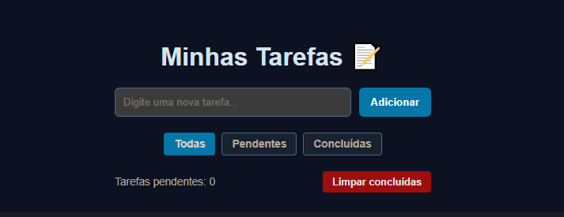

# 📝 Lista de Tarefas (To-Do List)

> Uma aplicação web interativa e responsiva para gerenciamento de tarefas diárias, com persistência de dados no navegador e filtros de visualização.

 *(Substitua ./preview.png pelo caminho da foto do seu projeto)*

---

## 💻 Sobre o Projeto

Este projeto foi desenvolvido como parte dos meus estudos práticos na **UniGrande (Fortaleza)** e no **freeCodeCamp**. O objetivo principal foi exercitar conceitos fundamentais de JavaScript vanilla, como manipulação do DOM, manipulação de arrays, tratamento de eventos e persistência de dados localmente no navegador.

🌐 **Acesse a aplicação no ar:** [To-Do List - GitHub Pages](https://elann89.github.io/to-do-list/)

---

## 🛠️ Tecnologias Utilizadas

- **HTML5:** Estruturação semântica da aplicação.
- **CSS3:** Estilização responsiva, layout dinâmico e efeitos visuais.
- **JavaScript (ES6+):** Lógica da aplicação, manipulação do DOM e lógica de filtros.
- **LocalStorage API:** Persistência dos dados no navegador (as tarefas permanecem salvas ao atualizar a página).
- **Git & GitHub:** Versionamento e hospedagem via GitHub Pages.

---

## ⚙️ Funcionalidades

- [x] Adicionar novas tarefas (por clique ou pressionando a tecla `Enter`).
- [x] Marcar/desmarcar tarefas como concluídas.
- [x] Remover tarefas individuais da lista.
- [x] **Filtros de visualização:** Filtrar tarefas entre *Todas*, *Pendentes* e *Concluídas*.
- [x] **Contador em tempo real:** Exibição da quantidade exata de tarefas pendentes.
- [x] **Limpeza em massa:** Botão para remover todas as tarefas concluídas de uma só vez (com confirmação).
- [x] **Persistência de Dados:** Salva tudo automaticamente no `localStorage`.

---

## 🚀 Como Executar o Projeto Localmente

1. Clone este repositório:
   ```bash
   git clone https://github.com/Elann89/to-do-list.git
   ```

2. Abra o arquivo `index.html` no seu navegador.